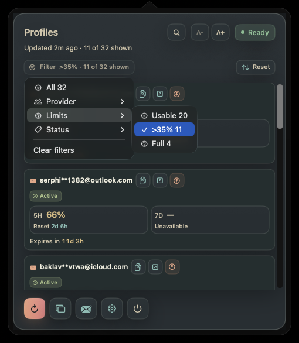
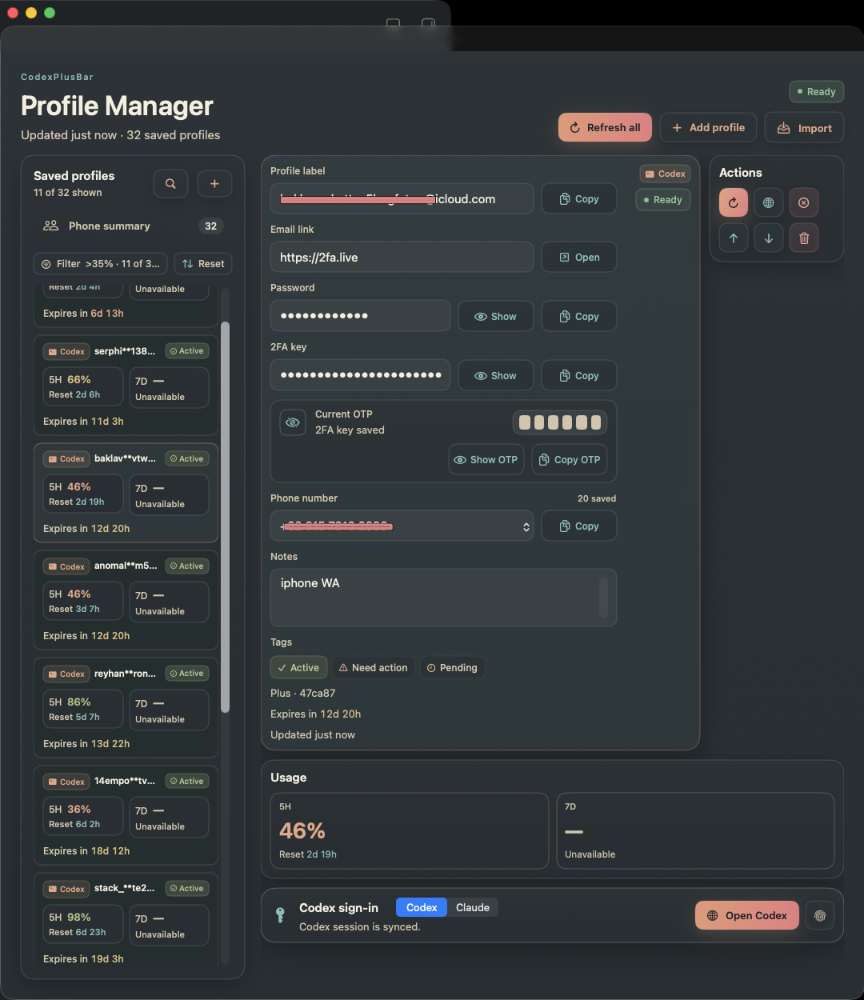

# CodexPlusBar

CodexPlusBar is a macOS menu bar app for people who use ChatGPT Plus and Codex often. It shows your remaining usage for saved profiles at a glance, so you can decide which account to use without opening ChatGPT, switching accounts, or guessing when limits reset.





Screenshots use demo data. Profile labels and links are censored.

## Why It Is Useful

When you use more than one ChatGPT profile, checking limits can become slow and annoying. CodexPlusBar keeps each profile in its own local WebKit session, then shows the important usage numbers from the menu bar. Think of it like a small fuel gauge for your ChatGPT work: you do not need to open the full dashboard just to know whether you still have room to keep going.

## Features

- Menu bar status with 5H and 7D remaining usage.
- Separate saved profiles, each with its own sign-in session.
- Profile manager for adding, renaming, reordering, and removing profiles.
- Bulk import for adding many profiles from `email|password|2FA` rows.
- Generate and copy the current OTP from a saved 2FA key.
- One-click refresh for all profiles or a single profile.
- Pin an important profile so it stays easy to watch.
- Save a label and email link for each profile.
- Open the saved email link from the menu bar or manager.
- Repair a profile by opening its sign-in session view.
- Clear a profile session when you want to sign in again.
- Zoom controls for the menu bar panel text.

## How To Use

1. Open CodexPlusBar.
2. Open the manager window from the menu bar panel.
3. Add a profile.
4. Or use Import to paste many `email|password|2FA` rows at once.
5. Sign in to ChatGPT in each profile's session view.
6. Save a clear label and optional email link.
7. Refresh usage.
8. Pin the profile you care about most.
9. Check 5H and 7D usage from the menu bar.

## Install

Download the latest notarized DMG from GitHub:

- [Latest release page](https://github.com/withLinda/CodexPlusBar/releases/latest)
- [Direct notarized DMG download](https://github.com/withLinda/CodexPlusBar/releases/download/snapshot-2026-07-15-cookie-session-fix/CodexPlusBar-snapshot-2026-07-15-cookie-session-fix.dmg)
- [SHA-256 checksum](https://github.com/withLinda/CodexPlusBar/releases/download/snapshot-2026-07-15-cookie-session-fix/CodexPlusBar-snapshot-2026-07-15-cookie-session-fix.dmg.sha256)

1. Download and open the DMG.
2. Drag `CodexPlusBar.app` onto the `Applications` folder inside the DMG.
3. If macOS asks, replace the older copy in Applications.
4. Wait for the copy to finish.
5. Open CodexPlusBar from your Applications folder.

The DMG and app are signed and notarized for macOS distribution, so macOS should be able to verify them normally.

### Build From Source

Use this if you want to run the app from the source code:

```bash
make build-and-run
```

To create a local developer DMG:

```bash
make dmg
```

The DMG is written to `build/dist/CodexPlusBar.dmg`.

## Requirements

- macOS 14 or newer.
- Xcode for building from source.
- A ChatGPT account for each profile you want to track.

## Privacy Note

Profile labels and sessions are stored locally on your Mac. CodexPlusBar uses your local ChatGPT web session to read usage data from ChatGPT.
